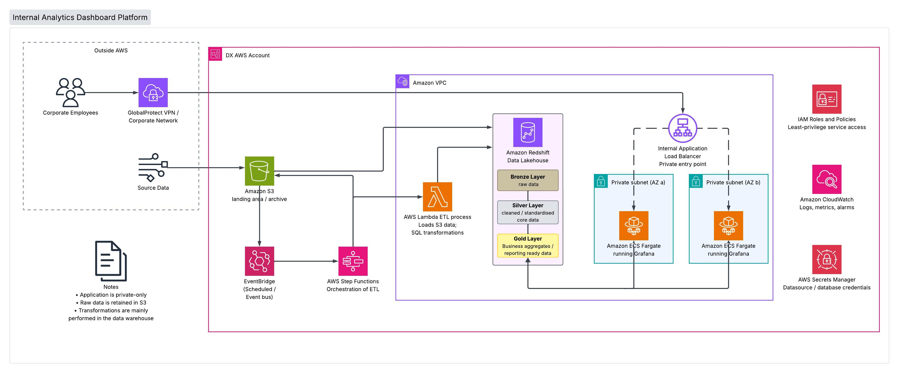

# DX AWS Re-architecture

This project is a small POC analytics platform built for the DX AWS Re-architecture technical exercise.

The local solution ingests sample sales data into PostgreSQL, transforms it with SQL, and exposes the reporting data through Grafana. The AWS design shows how the same workload could be productionised using managed AWS services.

## Local Proof of Concept

```text
Sales CSV
   ↓
Python ingestion
   ↓
PostgreSQL staging
   ↓
SQL transformation
   ↓
Reporting tables
   ↓
Grafana dashboard
```

### Tech Stack

- Python
- PostgreSQL 16
- SQL
- Docker / Docker Compose
- Grafana

## Running the Project

### 1. Start PostgreSQL and Grafana

```bash
docker compose up -d
```

### 2. Set up Python

```bash
python3 -m venv .venv
source .venv/bin/activate

pip install pandas sqlalchemy psycopg2-binary python-dotenv
```

### 3. Run the ingestion pipeline

```bash
python3 etl/load_sales.py
```

### 4. Open Grafana

```text
http://localhost:3000
```


## AWS Re-architecture



The proposed AWS design uses:

- **Amazon S3** for the landing and archive layer.
- **Amazon Redshift** as the analytics warehouse, organised into Bronze, Silver and Gold data layers.
- **AWS Lambda + Step Functions** for SQL execution and ETL orchestration.
- **Amazon EventBridge** for scheduled pipeline execution.
- **Amazon ECS Fargate** to run Grafana across private subnets.
- **Internal Application Load Balancer** as the private application entry point.
- **GlobalProtect / corporate network connectivity** so employees can access the platform without exposing it publicly.
- **IAM, Security Groups and Secrets Manager** for least-privilege access and credential management.
- **Amazon CloudWatch** for logs, metrics and alarms.

The application and data platform remain private within the VPC. Transformations are primarily performed inside the data warehouse so the platform can make use of Redshift's processing capabilities while retaining source data in S3 for replay and audit purposes.


## Production Considerations

For production, I would add automated deployments, incremental processing, data-quality checks, Redshift/S3 backup and recovery controls, CloudWatch alerting, and appropriate scaling based on workload demand.

The architecture is intentionally kept high-level and avoids unnecessary complexity for the scope of this exercise.
